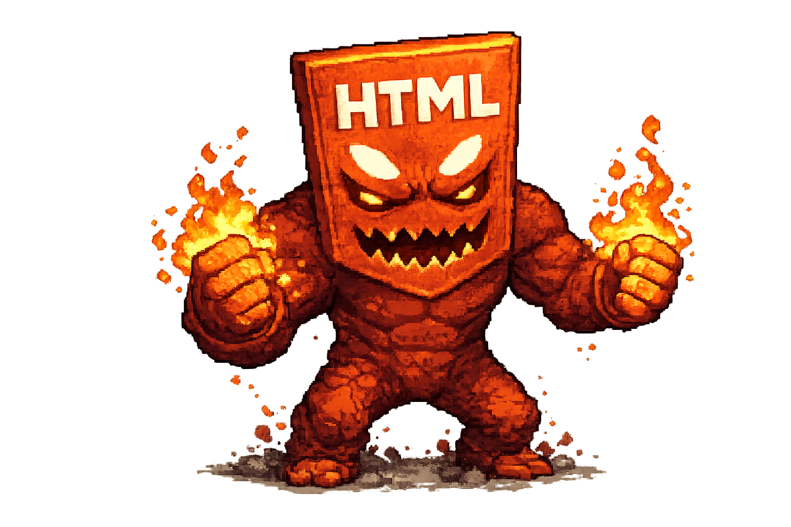
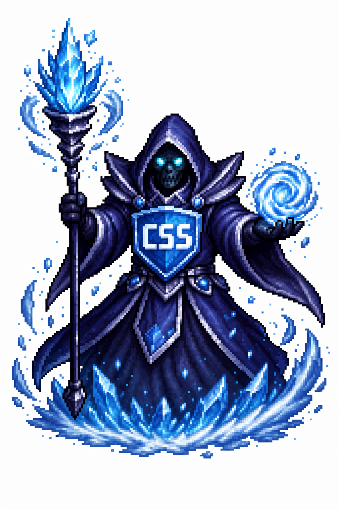

# From Zero to Hero

## Про проєкт

[Github Live Page](https://innasaienko.github.io/from-zero-to-hero/)

Ласкаво просимо до проєкту команди From Zero to Hero, створеного в межах
навчання на магістерській програмі. Цей проєкт демонструє наше опанування
базових навичок веброзробки.

### Наш шлях у проєкті

Під час роботи над цим проєктом ми уявляли HTML, CSS і JavaScript як окремих
персонажів, яких потрібно не просто вивчити, а справді "приручити".



Спочатку ми знайомилися з HTML — базовою силою, що відповідає за структуру та
каркас сторінки.



Далі опановували CSS, який додає стилі, настрій і візуальну виразність.


Завершальним викликом став JavaScript — інструмент, що надає сайту рух, логіку
та інтерактивність. Кожен із цих етапів був частиною нашого навчального шляху.

## Учасники команди


- [Інна Саєнко](https://github.com/InnaSaienko) — Team Leader
- [Інна Матвієнко](https://github.com/Merel1n) — Scrum Master
- [Гуленко Данило](https://github.com/Daniel254) — Developer
- [Ілля Сергунін](https://github.com/User-Student1) — Developer
- [Сергій Жданюк](https://github.com/serhiizx) — Developer
- [Анастасія Кузьміна](https://github.com/hontonoran) — Developer
- [Szabolcs Gönczy](https://github.com/g-szabolcs-b) — Developer
- [Віталій Черпак](https://github.com/OneThousandEyes) — Developer

## Стек технологій

- HTML5
- CSS3
- JavaScript (vanilla)
- GitHub Pages (deployment)
- Vite
- Node.js + npm (package.json, package-lock.json)
- GitHub Actions (CI workflow)

## Структура проєкту

<!-- prettier-ignore-start -->

```text
from-zero-to-hero/
├── .github/
│   └── workflows/
├── src/
│   ├── css/
│   ├── js/
│   ├── images/
│   ├── partials/
│   └── index.html
├── .gitignore
├── .prettierrc.json
├── README.md
├── package-lock.json
├── package.json
└── vite.config.js
```
<!-- prettier-ignore-end -->

## Як запустити проєкт локально

1. Склонуйте репозиторій:

```bash
git clone https://github.com/innasaienko/from-zero-to-hero.git
```

2. Перейдіть у папку проєкту:

```bash
cd from-zero-to-hero
```

3. Встановіть залежності:

```bash
npm install
```

4. Запустіть локальний сервер розробки:

```bash
npm run dev
```
